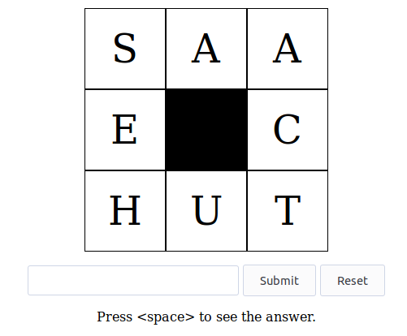

# Paardensprong
> Simple Express app to practice the paardensprong game.

Paardensprong is a game where you have to guess an eightletter word, using the moves of knight in chess.



## Installation

```sh
git clone https://github.com/rblinde/paardensprong.git
cd paardensprong
npm install
```

## Usage

When in the `paardensprong` directory, run:

```sh
node .
```

Open your webbrowser and go to `http://localhost:3000`.

## Words

The `words.txt` file contains 26 (Dutch) words. Edit these to fit your needs.

## License

Distributed under the MIT license. See ``LICENSE.md`` for more information.

## Contributing

1. Fork it (<https://github.com/rblinde/paardensprong/fork>)
2. Create your feature branch (`git checkout -b feature/fooBar`)
3. Commit your changes (`git commit -am 'Add some fooBar'`)
4. Push to the branch (`git push origin feature/fooBar`)
5. Create a new Pull Request
